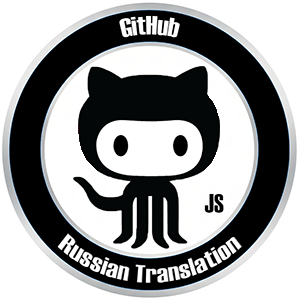

<div align="center">
  
</div>
<h1 align="center"> GitHub Russian Translation </h1>

## 🎯 Описание: ##
Пользовательский скрипт для автоматического перевода интерфейса GitHub на русский язык.

## 📝 Как установить и использовать: ##
**1. Установите Tampermonkey (если ещё не установлен):**
- [Chrome/Edge](https://chromewebstore.google.com/detail/tampermonkey/dhdgffkkebhmkfjojejmpbldmpobfkfo)
- [Firefox](https://addons.mozilla.org/en-US/firefox/addon/tampermonkey/)
- [Safari](https://apps.apple.com/us/app/tampermonkey/id1482490089)

**2. Скачайте скрипт:** 
- [GitHubRussianTranslation](https://github.com/smi-falcon/GitHub-Russian-Translation/blob/main/Userscript/GitHub%20Russian%20Translation.js)
- [GitHubTimeTranslation](https://github.com/smi-falcon/GitHub-Russian-Translation/blob/main/Userscript/GitHub%20Time%20Translation.js)
  
**3. Установите скрипт:**
- Откройте Tampermonkey (нажав на иконку в браузере).
- Нажмите на "Панель управления".
- Перенесите скачанный скрипт в открытую вкладку.

**4. Использование:**
- Скрипт автоматически активируется на всех страницах GitHub.
- Перевод применяется к основным элементам интерфейса.
- Работает с динамически загружаемым контентом.

## 🛠️ Настройка: ##
Вы можете легко добавить новые переводы или изменить существующие, редактируя объект ```translations``` в скрипте. Просто добавьте новые пары *"английский текст": "русский перевод"*.
Скрипт безопасен и работает только на страницах GitHub, не передавая никаких данных третьим лицам.

## 📚 Особенности скрипта: ##
- Обширный словарь: Переводит более 1000 основных терминов и элементов интерфейса GitHub.
- Обработка временных меток: Перевод относительного времени real-time, relative-time.
- Динамический перевод: Использует MutationObserver для перевода контента, загружаемого через AJAX.
- Умная замена: Переводит текст в элементах, атрибутах placeholder, aria-label, title и alt.
- Производительность: Оптимизирован для минимального влияния на скорость работы сайта.

## 📚 Что переводится: ##
- Основная навигация.
- Элементы репозитория.
- Кнопки действий.
- Страницы профиля и настроек.
- Временные метки.
- Формы и поля ввода.

## ⭐ Поддержка проекта: ##
Если вам понравился данный проект, поставьте ему звезду на GitHub.

## 📄 Лицензия: ##
- [MIT License](https://github.com/smi-falcon/GitHub-Russian-Translation/blob/main/License.md)